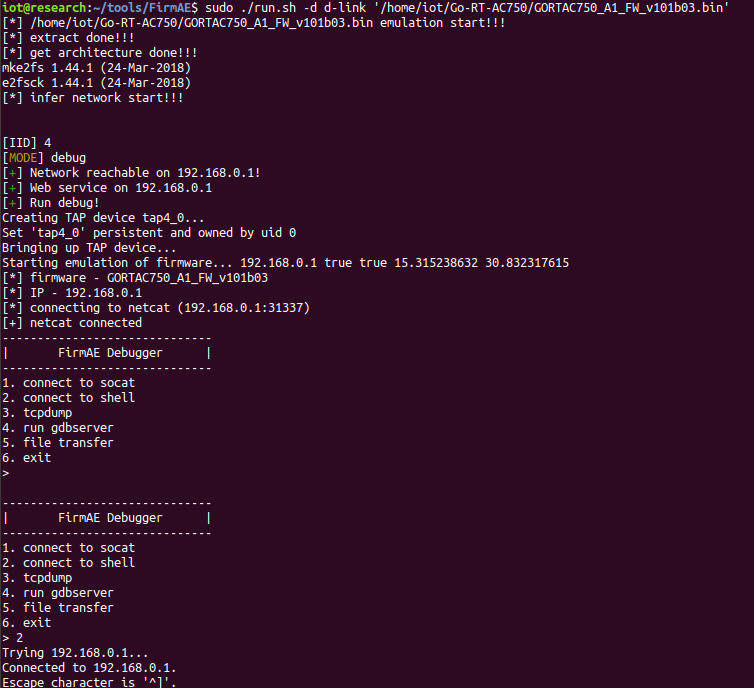
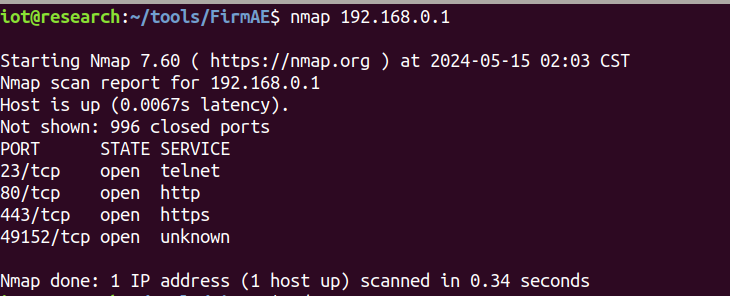
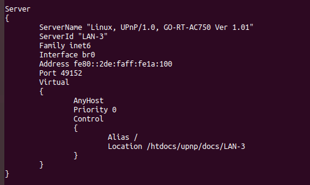
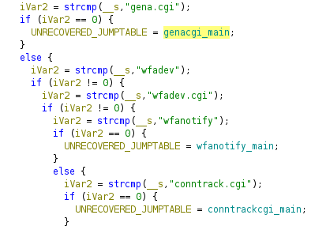
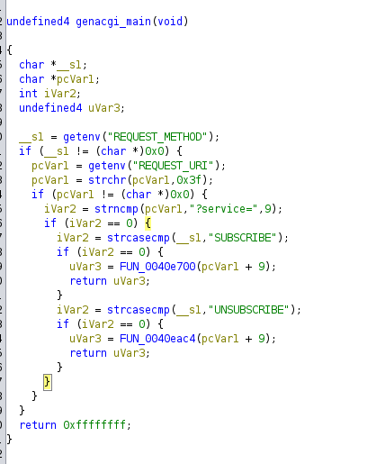

# D-Link Go-RT-AC750

## 仿真模拟

[固件下载地址](https://bbs.kanxue.com/thread-278294.htm#msg_header_h3_2)  
解包，提取出文件系统

```bash
binwalk -Me GORTAC750_A1_FW_v101b03.bin
```

使用FirmAE仿真

```bash
sudo ./run.sh -d d-link '/home/iot/Go-RT-AC750/GORTAC750_A1_FW_v101b03.bin' 
```

  
扫描端口发现一个未知端口49152  
  
在shell中查看/var/run/httpd.conf可知这是一个upnp服务端口  
  

## 固件分析

### CVE-2023-34800

[CVE-2023-34800](https://cve.mitre.org/cgi-bin/cvename.cgi?name=CVE-2023-34800)  
查看cve官网的表述可知此cve是通过genacgi_main函数实现命令注入漏洞。其属于cwe-78：Improper Neutralization of Special Elements used in an OS Command ('OS Command Injection')  
查找genacgi_main函数发现其在文件htdocs/cgibin中，将其放进Ghidra中查看genacgi_main函数。  
  

